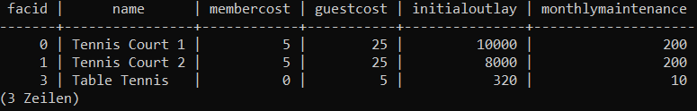
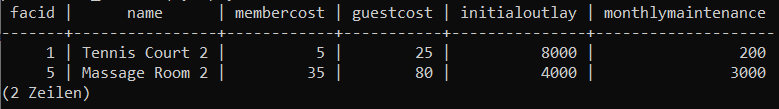
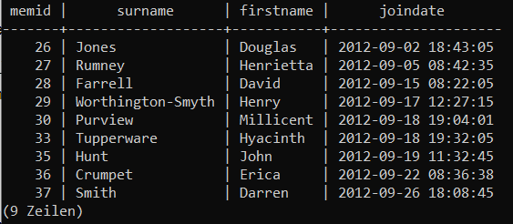

# SOS - Metriken für Sicherheit
#SOS #Vorlesung
	- > 
	-
-
-
-
- # MIS - VE02 AB
  #MIS #Übung #Statistik
	- > 
-
- # SWDDBS - Übung SQL
  #SWDDBS #Übung
	- > 
	- > 
	- **1.1)**
		- ```sql
		  SELECT * 
		  FROM cd.facilities 
		  WHERE name 
		  	LIKE '%Tennis%' ;
		  ```
		- 
	- **1.2)**
		- ```sql
		  SELECT *
		  FROM cd.facilities
		  WHERE facid 
		  	IN (1, 5) ;
		  ```
		- 
		-
	- **1.3)**
		- ```sql
		  SELECT memid, surname, firstname, joindate
		  FROM cd.members
		  WHERE joindate > '2012-09-02 00:00:00' ;
		  ```
		- 
		-